# Wazuh SOC Home Lab: SIEM, Detection Engineering & Alert Triage

> A self-hosted Security Operations Center (SOC) home lab built on Wazuh. I stood up a full SIEM, onboarded a real Windows endpoint with Sysmon and File Integrity Monitoring, simulated attacks, triaged the alerts, wrote a custom detection rule that catches obfuscation the built-in rule misses, and tuned a critical-severity false positive. I documented the failures and the fixes as I went, because that part is most of the learning.


**Author:** Sanjish KC · **Repo:** `github.com/sanjishkc/wazuh-soc-home-lab`

---

## Architecture

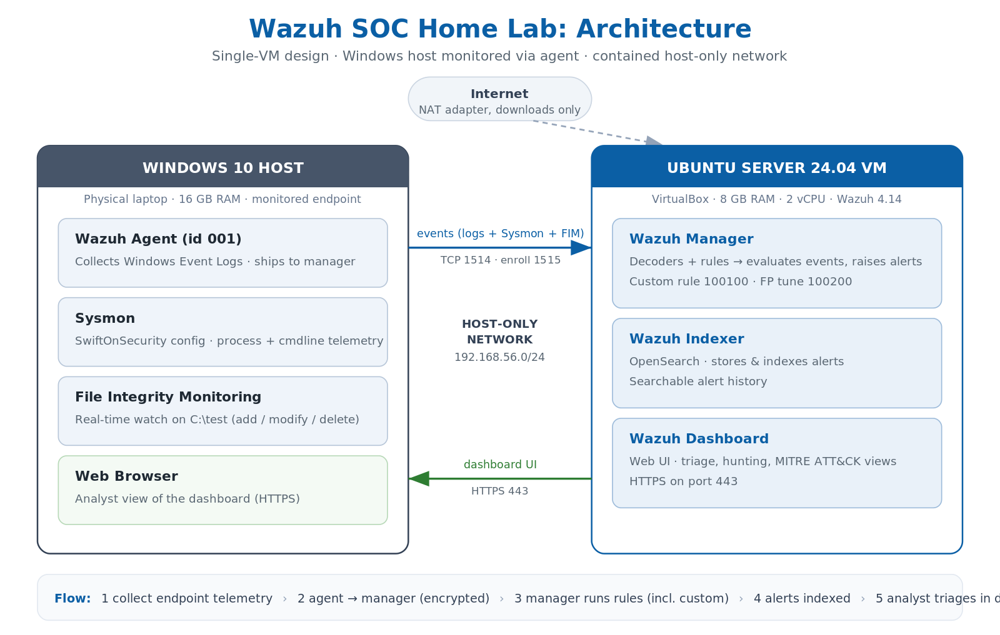

I used a single-VM design to fit constrained hardware. Only the Wazuh server runs in a VM, and the Windows host itself is the monitored endpoint via a lightweight agent. The two talk over an isolated host-only network, so no lab traffic leaves the machine. NAT is there only so the VM can download packages.

---

## Table of Contents

1. [Overview](#overview)
2. [Skills Demonstrated](#skills-demonstrated)
3. [Environment & Tooling](#environment--tooling)
4. [Build Walkthrough](#build-walkthrough)
5. [Troubleshooting Story: The Dashboard That Wouldn't Install](#troubleshooting-story-the-dashboard-that-wouldnt-install)
6. [File Integrity Monitoring](#file-integrity-monitoring)
7. [Detection 1: New Local Admin Account (T1136)](#detection-1-new-local-admin-account-t1136)
8. [Detection 2: Encoded PowerShell (T1059.001)](#detection-2-encoded-powershell-t1059001)
9. [Detection Engineering: Custom Rule](#detection-engineering-custom-rule)
10. [Detection Engineering: False-Positive Tuning](#detection-engineering-false-positive-tuning)
11. [Lessons Learned](#lessons-learned)
12. [Repository Structure](#repository-structure)
13. [Reproduce It](#reproduce-it)
14. [References](#references)

---

## Overview

This project builds a working SOC and then does the day job of a SOC analyst: generate security telemetry, detect simulated attacks, map each detection to the MITRE ATT&CK framework, and read, write, and tune detection rules.

I built it on modest hardware (an 8 GB laptop, later upgraded to 16 GB). That constraint is part of the story rather than something I hid. It forced a single-VM design and, at one point, a disk-space failure I had to diagnose from the logs and fix.

What I did in this build:

- Deployed the full Wazuh stack (manager, indexer, dashboard) on a VM, and recovered it after a failed install.
- Onboarded the Windows host as an agent and enriched its telemetry with Sysmon and File Integrity Monitoring.
- Simulated two attacks, then triaged the alerts down to who did what to whom and decoded an obfuscated PowerShell payload.
- Read a built-in detection rule, found the case it misses, and wrote a custom rule to cover it.
- Investigated a critical-severity alert, confirmed it was a false positive, and tuned it out without silencing the real threat.
- Kept a running log of every failure and how I fixed it.

---

## Skills Demonstrated

| Area | Evidence in this project |
|---|---|
| SIEM deployment & operations | Wazuh all-in-one install, service management, post-reboot recovery |
| Endpoint onboarding | Wazuh agent on Windows, agent enrollment over host-only network |
| Telemetry enrichment | Sysmon (SwiftOnSecurity config), File Integrity Monitoring |
| Alert triage | Read alerts to subject/target/SID; escalation judgment by severity |
| Threat detection | New admin account (T1136), encoded PowerShell (T1059.001) |
| Detection engineering | Custom rule `100100` that catches cases built-in `92057` misses |
| Alert tuning | Surgical false-positive suppression of critical rule `92213` |
| Payload analysis | Decoded base64 `-EncodedCommand` to reveal intent |
| MITRE ATT&CK mapping | Techniques tagged on every detection |
| Linux / infrastructure troubleshooting | LVM disk expansion, broken dpkg recovery, service auth-sync |

---

## Environment & Tooling

| Item | Selection | Notes |
|---|---|---|
| Hypervisor | Oracle VirtualBox 7.2 | Snapshots for safe rollbacks |
| Guest OS | Ubuntu Server 24.04.4 LTS | Server (no GUI); supported by Wazuh 4.14 |
| SIEM | Wazuh 4.14.6 (assisted all-in-one) | Manager, indexer, and dashboard |
| Endpoint | Windows 11 host (16 GB RAM) | Monitored via Wazuh agent (id 001) |
| Endpoint telemetry | Sysmon + SwiftOnSecurity config | Process, command-line, file, and registry visibility |
| Server VM | 8 GB RAM, 2 vCPU, 54 GB disk | Sized for the all-in-one stack |
| Networking | NAT + Host-only (`192.168.56.0/24`) | Internet for downloads; contained host-to-VM link |

---

## Build Walkthrough

### 1. Ubuntu Server VM

I created an Ubuntu Server 24.04 VM in VirtualBox with two adapters: NAT for downloads and Host-only for the contained host-to-VM link. One VirtualBox 7.2 gotcha caught me here. The second network adapter only appears once you switch the Network settings to Expert mode.

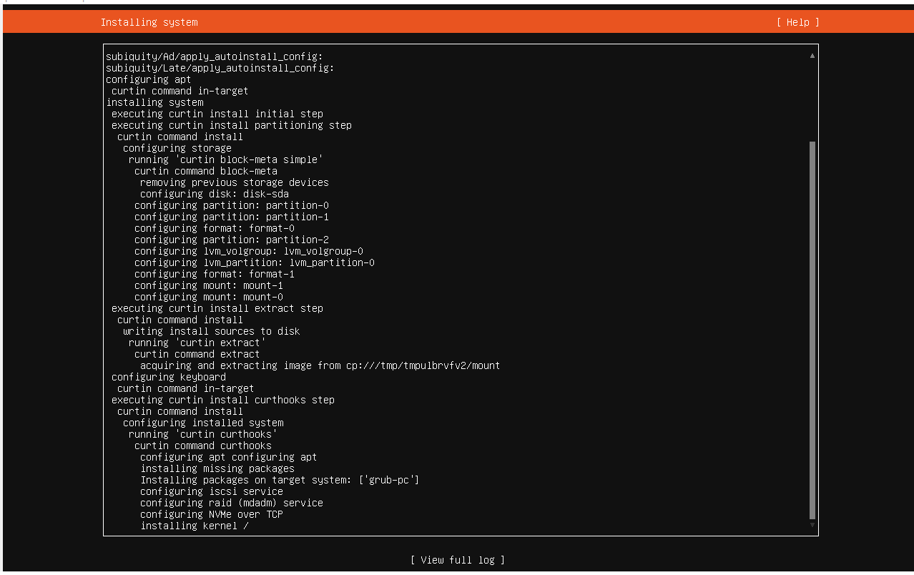
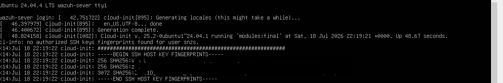

### 2. Low-RAM safety net: swap

Before installing Wazuh I added a swap file so a memory spike would not trigger the out-of-memory killer.

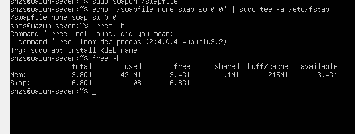

### 3. Wazuh install (assisted, all-in-one)

```bash
curl -sO https://packages.wazuh.com/4.14/wazuh-install.sh && sudo bash ./wazuh-install.sh -a
```

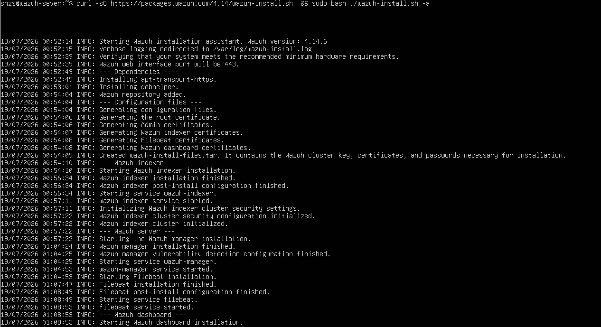

The indexer, manager, and Filebeat installed cleanly. The dashboard step failed repeatedly, which is its own story below. Once the root cause was fixed, the install completed:

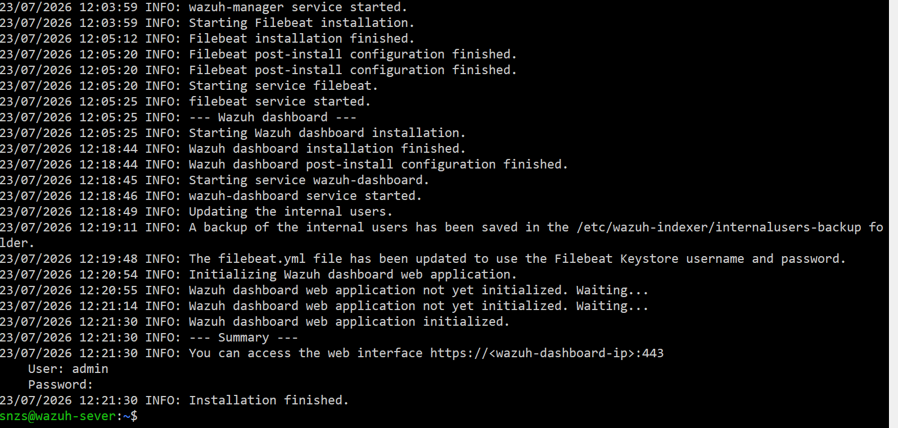

The dashboard is reachable over the host-only network at `https://192.168.56.102`. Note that it is HTTPS on port 443, not HTTP.

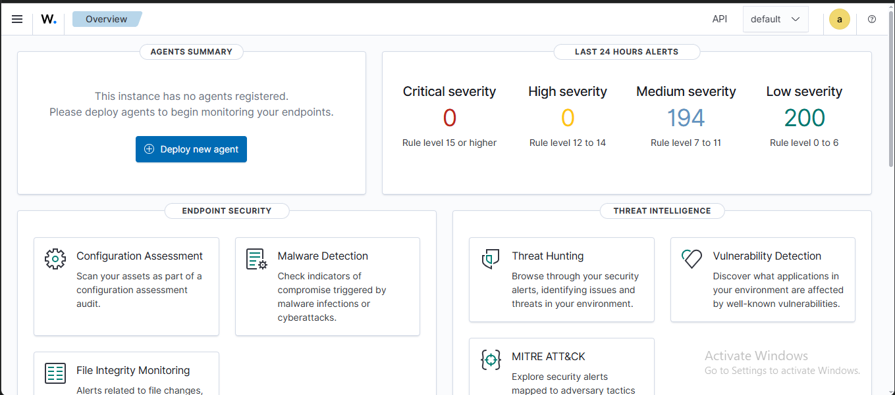
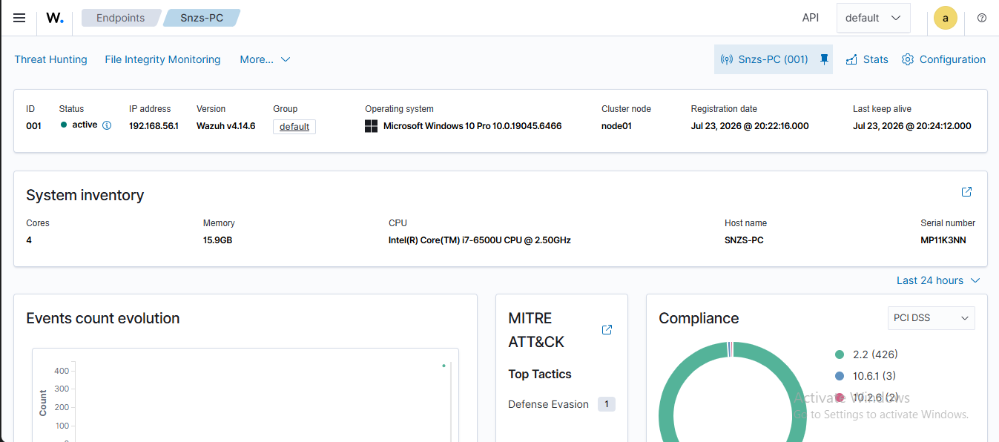

### 4. Onboard the Windows endpoint and Sysmon

I deployed the Wazuh agent to the Windows host, pointed at the manager's host-only IP. Then I installed Sysmon with the SwiftOnSecurity config and added a `<localfile>` block so Wazuh ingests the `Microsoft-Windows-Sysmon/Operational` channel. Sysmon's command-line visibility is what makes the later detections useful, since it records the exact command that ran.

---

## Troubleshooting Story: The Dashboard That Wouldn't Install

The Wazuh dashboard failed to install four times, rolling the whole stack back each time. This is the part of the project I am most glad I documented, because it shows how I work a problem instead of guessing.

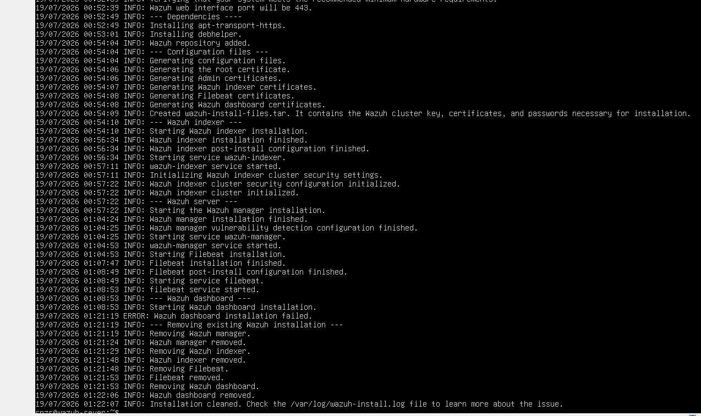

My first theory was memory. I assumed the dashboard's memory-heavy build step was getting OOM-killed, so I added swap, raised the VM from 4 GB to 5 GB, and eventually upgraded the laptop to 16 GB and gave the VM 8 GB. It still failed at the same step. That ruled memory out.

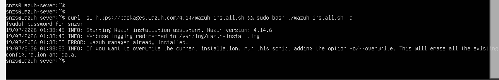

So I stopped guessing and read the log:

```bash
sudo grep -iE "error|fail|no space|killed" /var/log/wazuh-install.log | tail -40
```

The real error was sitting right there:

```
E: Write error - write (28: No space left on device)
```

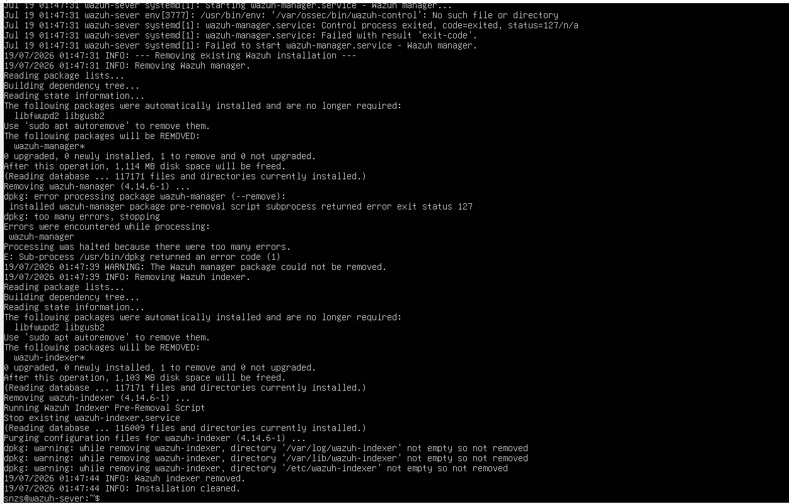

The root cause was the Ubuntu LVM "half the disk" default. The guided install had given the root filesystem only about 27 GB of the 50 GB disk and left the rest unused in the volume group:

```bash
df -h /      # root only 27G, filling during install
sudo vgs     # VSize 54G, VFree 27G  <-- half the disk unallocated
```

The fix was two commands. Grow the logical volume, then grow the filesystem inside it:

```bash
sudo lvextend -l +100%FREE /dev/ubuntu-vg/ubuntu-lv   # grow the logical volume
sudo resize2fs /dev/ubuntu-vg/ubuntu-lv               # grow the ext4 filesystem
df -h /                                               # now 54G, 43G free
```

There was a second obstacle. The failed installs had left a half-removed `wazuh-manager` package whose uninstall script errored, plus orphaned processes still holding ports 1515 and 55000. I cleaned it by hand:

```bash
sudo pkill -9 -f wazuh
sudo rm -f /var/lib/dpkg/info/wazuh-manager.prerm /var/lib/dpkg/info/wazuh-manager.postrm
sudo dpkg --purge --force-all wazuh-manager
sudo rm -rf /var/ossec
```

A clean re-run then succeeded. The lesson I took from this: read the log before you touch anything. I spent time (and money on RAM) on a memory theory when the real problem was disk space from Ubuntu's default LVM layout.

One more issue showed up after a reboot. The dashboard reported `[API connection] No API available to connect` and then an auth-token error. Restarting only the manager had left its API and the indexer's security out of sync.

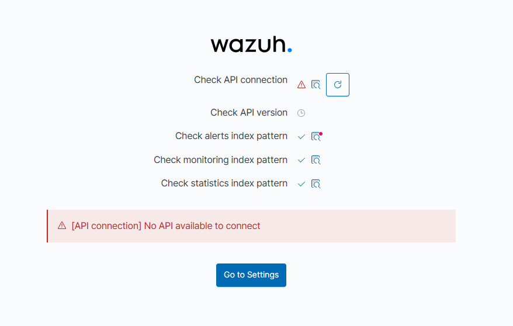

The fix was to restart the whole stack in order:

```bash
sudo systemctl restart wazuh-indexer     # (wait ~60s)
sudo systemctl restart wazuh-manager     # (wait ~30s)
sudo systemctl restart wazuh-dashboard
```

---

## File Integrity Monitoring

I added a real-time FIM watch on `C:\test` in the agent config, then created, modified, and deleted a file. All three events fired with file hashes and a content diff.

```xml
<directories check_all="yes" realtime="yes" report_changes="yes">C:\test</directories>
```

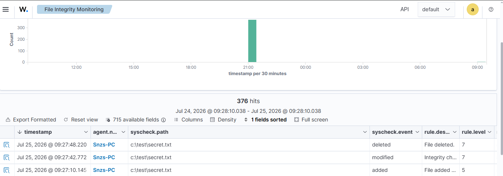

| Event | Wazuh rule |
|---|---|
| File added | 554 |
| File modified | 550 |
| File deleted | 553 |

A tuning note worth recording: Wazuh's `<ignore>` is global, with no per-directory option. A default `sregex` ignore for `.log/.htm/.jpg/...` was silently suppressing `.log` files in the monitored folder. Good reminder that "monitored" does not mean "reported" when an ignore rule matches the path.

---

## Detection 1: New Local Admin Account (T1136)

The simulation, run on the host and cleaned up afterward:

```powershell
net user hacker Password123 /add
net localgroup administrators hacker /add
net user hacker /delete            # cleanup
```

That one action produced a cluster of correlated alerts across two data sources: Windows Security events and Sysmon process-create events showing the literal command line.

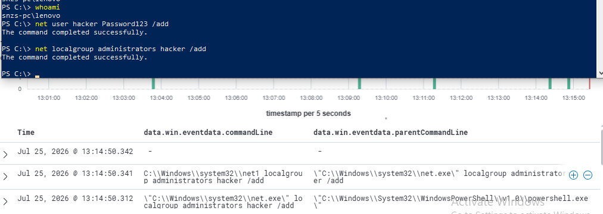

The alert to escalate is `rule.id 60154`, "Administrators Group Changed", at level 12, from Windows Event 4732. Reading it down to who did what to whom:

- Subject (who): `LENOVO`, the acting account
- Target (what): the `Administrators` group, `targetSid S-1-5-32-544`, which is the built-in local Administrators SID on every Windows machine
- `firedtimes: 2`, because it caught both the add (4732) and the cleanup removal (4733)

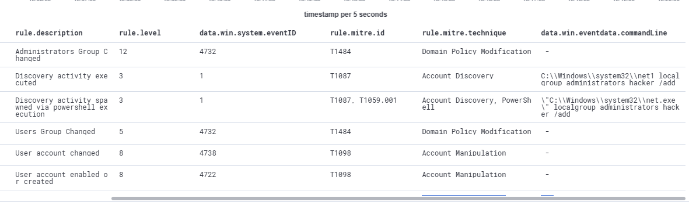

One detection-engineering observation. Wazuh tagged this as T1484 (Domain Policy Modification), which is imprecise for a local admin-group change. T1098 or T1136 fit it better. The stock rule-to-ATT&CK mappings are useful but not always exact.

---

## Detection 2: Encoded PowerShell (T1059.001)

The simulation uses a harmless payload wrapped in the obfuscation shape attackers actually use (`-NoProfile -WindowStyle Hidden -EncodedCommand`):

```powershell
$cmd = 'Write-Host "hello from encoded powershell"'
$enc = [Convert]::ToBase64String([System.Text.Encoding]::Unicode.GetBytes($cmd))
powershell.exe -NoProfile -WindowStyle Hidden -EncodedCommand $enc
```

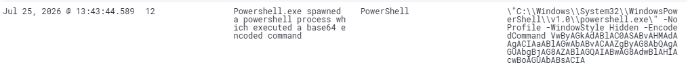

Wazuh caught it out of the box at level 12, `rule.id 92057`, "Powershell.exe spawned a powershell process which executed a base64 encoded command."

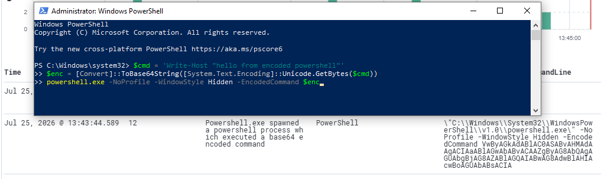

Then the analyst move: decode the payload. An attacker's `-EncodedCommand` hides what they actually ran, so I decoded it to reveal the intent:

```powershell
[System.Text.Encoding]::Unicode.GetString([Convert]::FromBase64String('<base64>'))
```

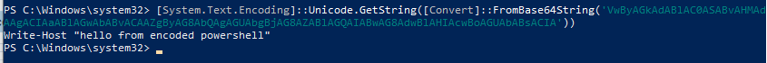

In a real incident this same step reveals the malware's true command, whether that is a download URL, a follow-on payload, or something else.

---

## Detection Engineering: Custom Rule

I read the built-in rule that caught Detection 2 (`92057`) and found two blind spots:

1. It requires `parentImage = powershell.exe`, so it misses encoded PowerShell launched from `cmd.exe`, an Office macro, or `wscript.exe`.
2. Its regex lists `en|enco|encode|encodedcommand` but skips `enc` and `encoded`, which are the abbreviations attackers most often use.

My custom rule (`rules/local_rules.xml`, id `100100`, level 12) drops the parent requirement and closes the abbreviation gap:

```xml
<rule id="100100" level="12">
  <if_group>sysmon_event1</if_group>
  <field name="win.eventdata.commandLine" type="pcre2">(?i)powershell\.exe.+\-\b(encodedcommand|encoded|encode|encod|enco|enc|en|ec|ea|e)\b</field>
  <description>Encoded PowerShell executed (any parent process, incl. -enc/-encoded) - possible obfuscation [custom]</description>
  <mitre><id>T1059.001</id></mitre>
</rule>
```

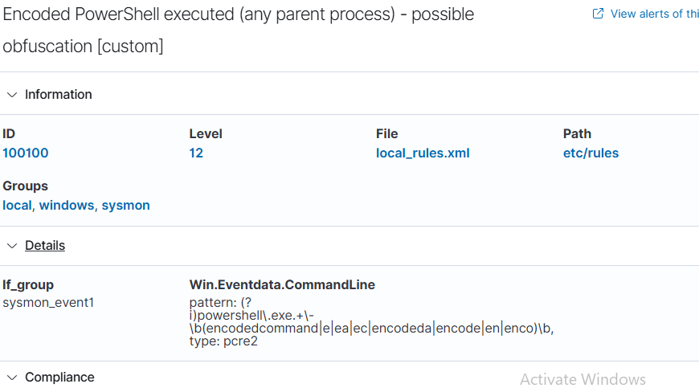

To prove it fills the gap, I launched `powershell.exe -nop -w hidden -enc <base64>` from `cmd.exe`, which is exactly the case stock rule 92057 misses (wrong parent, plus the `-enc` abbreviation). Rule `100100` fired at level 12 where 92057 stayed silent.

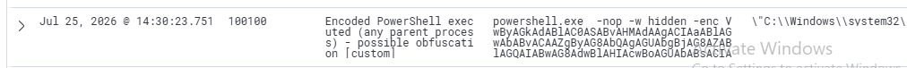

How I would describe it in an interview:

> I analysed Wazuh's built-in encoded-PowerShell rule, found it only fires when PowerShell is the parent and that it missed the `-enc` and `-encoded` abbreviations, and I wrote a custom rule that detects encoded PowerShell regardless of the parent process.

---

## Detection Engineering: False-Positive Tuning

Ranking alerts by volume and severity turned up something worth chasing. Level 15 (critical) alerts were firing around 25 times a day. Critical alerts should be rare, so I looked into it.

They were `rule.id 92213`, "Executable file dropped in folder commonly used by malware" (T1105), firing on files like:

```
C:\Users\...\AppData\Local\Temp\__PSScriptPolicyTest_<random>.<random>.ps1
```

The random-looking, ever-changing filenames almost looked like DNS-style exfiltration, so I investigated to a conclusion rather than assuming. It turned out to be PowerShell's own execution-policy self-test: a throwaway `.ps1` written to Temp, run to check the policy, then deleted. Local file creation by the signed system `powershell.exe`, no network, and random temp naming. A benign behaviour caught by rule 92213's broad "any script in Temp" heuristic, which made it a false positive at the highest severity.

The tune (`rules/local_rules.xml`, id `100200`, level 0) silences only the self-test and leaves 92213 live for any real drop:

```xml
<rule id="100200" level="0">
  <if_sid>92213</if_sid>
  <field name="win.eventdata.targetFilename" type="pcre2">(?i)__PSScriptPolicyTest_</field>
  <description>Benign PowerShell execution-policy self-test in Temp - tuned FP, rule 92213 stays live for real drops [custom]</description>
</rule>
```

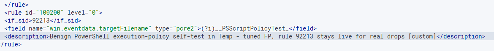

I checked both directions. After the tune, the PowerShell self-tests went silent, but dropping a real `ero-virus.bat` into Temp still fired 92213 at level 15. The noise is gone and the signal is intact.

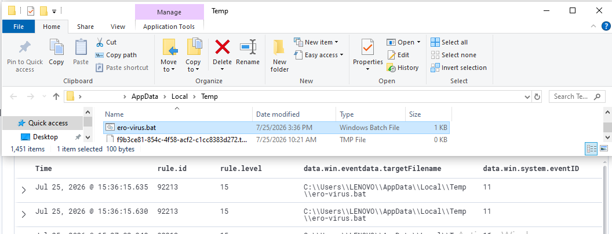

A false positive at level 15 does more damage than a hundred at level 3, because analysts start ignoring the critical queue. That is why I tuned it with a specific condition instead of muting the whole rule.

---

## Lessons Learned

1. Fit the architecture to the hardware. A single-VM design let a full SIEM run on a constrained laptop.
2. Match the OS to the tool. I used Ubuntu 24.04, not the newest 26.04, because Wazuh 4.14 supports it.
3. Read the log before acting. The dashboard failures were disk space, not RAM.
4. Ubuntu's guided LVM install often uses only half the disk. `lvextend` plus `resize2fs` reclaims it.
5. To fix a broken dpkg package, blank its `prerm` and `postrm` scripts, then force-purge.
6. After an API auth-token error, restart the stack in order: indexer, then manager, then dashboard.
7. Sysmon's `commandLine` field is what turns "a process ran" into a real detection.
8. Read the built-in rule before you write or tune. Its logic shows you the exact gap.
9. Tune false positives with a specific condition (`if_sid` plus a `field` match plus `level 0`) rather than muting a rule that also catches real threats.
10. A critical false positive is the most damaging kind, because it trains analysts to ignore the top-priority queue.

---

## Repository Structure

```
wazuh-soc-home-lab/
├── README.md                     # this document
├── images/
│   ├── architecture.svg / .png   # architecture diagram
│   └── screenshots/              # evidence for every step
├── rules/
│   └── local_rules.xml           # custom rule 100100 + FP tune 100200
└── docs/
    ├── Wazuh-SOC-Home-Lab-Report.pdf   # printable version of this document
    └── engineering-log.md        # detailed log: issue, diagnosis, fix
```

---

## Reproduce It

1. Create an Ubuntu Server 24.04 VM with NAT and Host-only adapters. Expand the LVM root to use the full disk.
2. `curl -sO https://packages.wazuh.com/4.14/wazuh-install.sh && sudo bash ./wazuh-install.sh -a`
3. Deploy the Wazuh agent to a Windows host, pointed at the manager's host-only IP.
4. Install Sysmon with the SwiftOnSecurity config and add the `Microsoft-Windows-Sysmon/Operational` localfile block to the agent.
5. Drop `rules/local_rules.xml` into `/var/ossec/etc/rules/` and restart the manager.
6. Run the Detection 1 and Detection 2 simulations and confirm the alerts and the custom rule fire.

---

## References

- [Wazuh documentation](https://documentation.wazuh.com/current/) and [installation guide](https://documentation.wazuh.com/current/installation-guide/index.html)
- [Sysmon (Sysinternals)](https://learn.microsoft.com/sysinternals/downloads/sysmon) and [SwiftOnSecurity sysmon-config](https://github.com/SwiftOnSecurity/sysmon-config)
- [MITRE ATT&CK](https://attack.mitre.org/): T1136, T1059.001, T1105, T1098
- [Wazuh ruleset reference](https://documentation.wazuh.com/current/user-manual/ruleset/index.html)

---

*Built and documented by Sanjish KC as a hands-on blue-team / SOC portfolio project. Every screenshot is from my own lab.*
